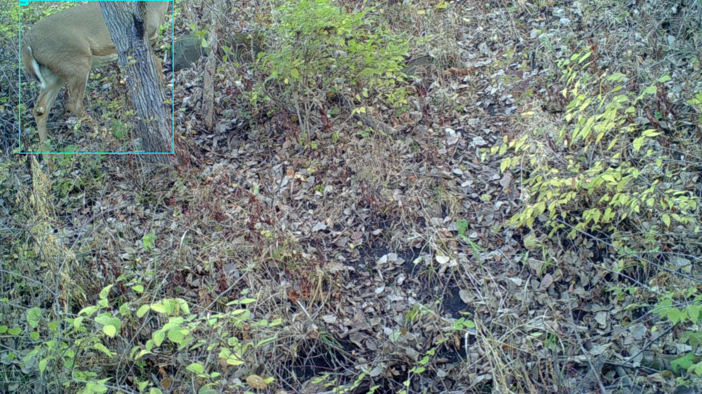
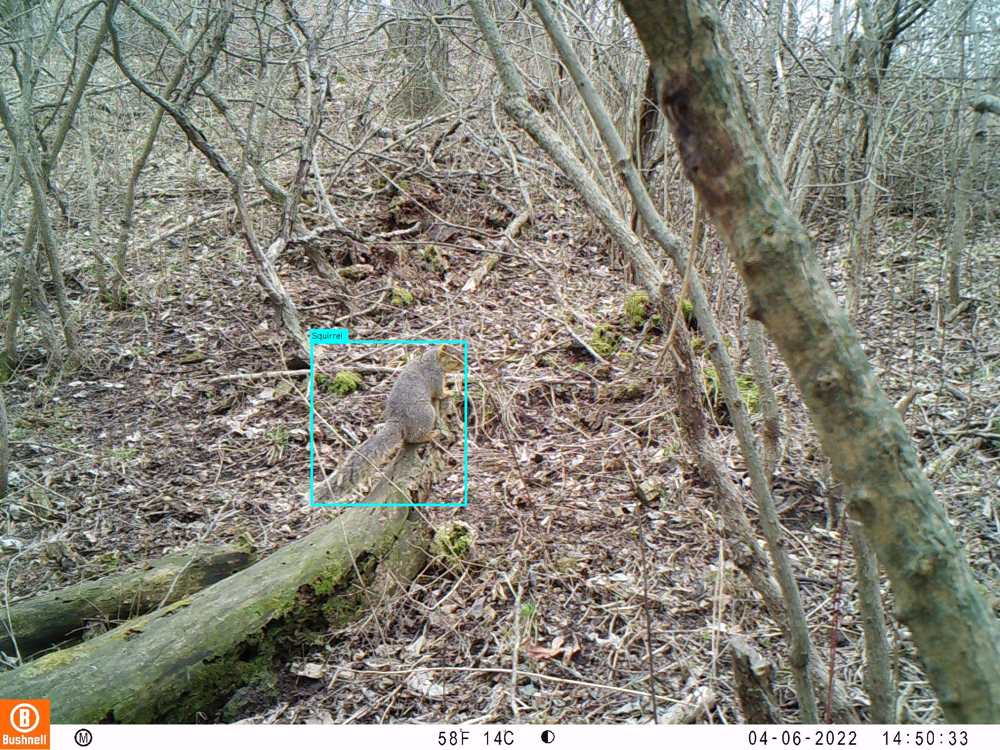

# Commercial Grade Trailcam Dataset

This small dataset ("Sample Dataset") contains a random sampling of images of North American wildlife taken via trail cameras (trailcams).
This small sampling was taken from a much larger dataset ("The Dataset") containing more than 55,000 images and their labels.
The Sample Dataset contains at least 30 images of each of the classes in The Dataset.

| class                     | images | labels |
|---------------------------|--------|--------|
| Bobcat                    | 374 | 400    |
| Coyote                    | 773 | 788    |
| Deer                      | 11804 | 13773  |
| DeerBuck                  | 9995 | 10498  |
| DeerBuckHead              | 9995 | 10498  |
| DeerDoe                   | 9967 | 10963  |
| Possum                    | 872 | 877    |
| Rabbit                    | 2936 | 2947   | 
| Raccoon                   | 5811 | 6001   |
| Squirrel                  | 3833 | 4011   |
| Turkey                    | 3290 | 7665   |
| BackgroundOnly            | 7325 | n/a    |
| BackgroundWithOtherLabels | 1916 | n/a    |
| UniqueImages              | 56128| n/a    |

The images in The Dataset are "as is" as they were collected from the cameras. They have not been resized, brightened, sharpened, etc.

Due to the number of images and the fact the images have not been resized The Dataset is large. It comprises ~35 `.zip`
files ranging in size from ~100MB to over 10GB.

For information and pricing for the full dataset please contact [buckfinderapp@gmail.com](mailto:buckfinderapp@gmail.com).

## Labels

The Dataset contains images with these 11 classes ("The Primary Labels"):

    Bobcat
    Coyote
    Deer
    DeerBuck
    DeerDoe
    Possum
    Rabbit
    Raccoon
    Squirrel
    Turkey
    DeerBuckHead

These labels are described more below.

The Dataset also includes images with no wildlife, and more images with some wildlife of different species than The Primary Labels. See [The Images](#the-images) for more info.

Here are the classes included in labels for some images but since they are not the primary goal of The Dataset these labels are not in The Primary Labels.
Such images can be useful as negative images when training:

    Badger
    Bird
    Cat
    Dog
    Groundhog
    Horse
    Human
    Mink
    MountainLion
    Mouse
    Owl
    Pheasant
    PheasantRooster
    Skunk
    Unknown
    Vehicle

The labels are provided in [Pascal VOC format](https://roboflow.com/formats/pascal-voc-xml).
If you are interested in licensing The Dataset and need the labels in a different format please contact us at [buckfinderapp@gmail.com](mailto:buckfinderapp@gmail.com).

# Labels Quality

The bounding boxes are consistently tight around the critters. Tighter bounding boxes means better models, more accurate detections
for computer vision applications.

These labels have been thoroughly curated for correctness. Numerous techniques have been used to identify images that had been
mis-labeled in some way. When such a mis-labeling was found it was immediately corrected.

A few of the techniques used to achieve this high quality dataset include:
- Training multiple models like a YOLOv6 and YOLOv8 model on the dataset then visually looking at images where their predictions differ and correcting bad labels when found. 
- The labels for every image have been visually inspected at least twice. Once during labeling. And at least once more, done at a later date than the labeling, as a sanity check.
- DeerBuckHead labels have been verified to be entirely within the bounding box of the related DeerBuck label.
- A single person labeled all the images. Thus, there is a high level of consistency versus having numerous labelers perhaps interpreting the labeling instructions differently, or not being quite as quality conscious about correct and tight bounding boxes.

We stand behind the quality of this dataset. If you're interested in this dataset contact us for our quality guarantee at [buckfinderapp@gmail.com](mailto:buckfinderapp@gmail.com).

# The Images

Most of the images in The Dataset were acquired using a variety of make and models of trailcams. Further, even for the same model trailcam
images may be of different size and quality due to various trailcam settings being purposely altered to collect more widly varying images. Some examples of variables that were purposely varied:

- Camera height, pitch, roll and yaw
- Time of year. Spring, summer, fall, winter.
- Background. Trees vs grass vs water, bright vs dark, confined spaces vs open panoramas, etc.
- Sunlight exposure. E.g. At times cameras were purposely pointed to cause sun glare at some point during the day.
- Image resolution.
- PIR (Passive InfraRed) settings.
- Information strip at the bottom. Most trailcams allow this to be captured in the image, or excluded from the image.

Some images may appear similar to other images. In many cases this is because a YOLO model missed a detection in one of the images that another
YOLO model found. So there is something in one of the images - but not the other - that caused the model to miss or mis-classify a detection.
Hence the image is (was) in some way interesting at least in the context of the models that were used to sanity check the labels for the images.

When labeling some of the images, especially really dark ones taken at night where the critter is towards a darker edge of the image,
some photo enhancements were applied as needed to be able to discern the wildlife in the image. In most cases simply applying applying
a brightness filter was enough to be able to see the wildlife. In some more rare cases the labeler had to adjust the contrast. In all such
cases the labels were applied using the benefit of the enhanced image but the original image is included in the dataset, not the enhanced image.
So when you see an image and think, "it's too dark and I can't see anything there" try viewing the image in a tool that allows
you to increase the brightness and/or contrast. You should be able to see the labeled critter(s) then.
Computers can be trained to see things that we humans cannot see!

The Dataset also contains images that contain no wildlife in them (aka "background images").
Some of these background images include no wildlife of any kind. These are the BackgroundOnly images referred to in the table at the top of this document.
Some of these background images include species of wildlife that are not in The Primary Labels. These are the BackgroundWithOtherLabels images referred to in the table at the top of this document.
Background images make up ~15% of the images in The Dataset.

These are included to help with negative training/testing. In many cases these negative images were causing false positive detections for
certain trained models. Thus, they are included to help models avoid false positives.

# File Organization

The labels for a given image are located in the same dir as the image with the label file having a `.xml` extension instead of the image's `.jpg` or `.jpeg` extension.

The files in the [./DatasetSamples](./DatasetSamples) directory have been organized at the top level by the species of critter.
This is done in the Sample Dataset to make it easier to casually navigate and view the images and labels. The next sub-directory under the species
name is a directory that indicates the month the images were gathered. Below that date-related directory name the structure varies.
But in all cases the label file for a given image is in the same dir as the image.

Note that some images in the, say, Deer directory also contain other classes like DeerDoe or DeerBuck. But all images in the Deer directory contain
at least one Deer, for example.

Enumerating all the images and their labels in The Dataset can be done by recursively case-insensitively looking for image files (`.jpg`, `.jpeg`, `.png`, `.gif`, `.webp`, `.heic`) that have a corresponding `.xml` file in the same directory.

# Image Ownership and Copyright

The images in The Dataset were obtained by private parties who have given consent for the images to be included in The Dataset
on a non-exclusive royalty free basis.

# Instructions Used To Label The Dataset

Good, clear instructions on how to apply labels to images for computer vision tasks are essential to having a quality dataset.
The following are the criteria that were used to apply labels to The Dataset.

## General Labeling Criteria

Include only the visible portions of a label. Do not include obscured portions of a label just because you think/know
it is there but hidden.

However, if a label is obscured by something such that one can determine that the label starts
on one side of the obstruction and continues on the other side of the obstruction then include the entire label, including
obstructed portion.

An example where the critter is partially hidden behind a tree near the image edge.
The entire visible part of the critter is included in the bounding box:

Another example where the critter is partially hidden. This shows that the hidden part of the critter, its eyes and nose, are not
included in the bounding box since they are not visible:

Only label those critters that can be identified on their own without further context beyond what is in the image.
Critters in the distance should be labeled as long as they can be confidently identified. But if a critter is too far
away and is thus too small to confidently identify it should not be labeled. But other critters that can be identified
in the image should still be labeled of course.

Critters that are only partially visible at the edge of the image should have a bounding box around their visible parts that are within the image.

If two critters overlap then put a bounding box around the visible portions of each visible part that clearly belongs to one critter.

For example, the farthest turkey is obscured by the nearer one:

## Species Specific Labeling Criteria

### Bobcat

Include the entire critter in the bounding box.

### Coyote

Include the entire critter in the bounding box including tail up to the point where hair becomes indiscernible.

### DeerDoe

Must be able to definitively see that there are no antlers, even a single short one on one side obscured by ears.
Can we definitively see that there is not a single small antler hidden by an ear or tree, possibly just on one side? If not, label it a Deer.

Here's an example showing what is clearly a DeerDoe facing the camera. And another deer where we cannot see it's head at all, thus it gets labeled simply, Deer.

### DeerBuck

Bounding box contains the entire (visible parts of) the deer includig antlers. Antlers must be visible for it to be considered a buck.
Even if only the antlers or antlers an a portion of the head or face are visible it should be labeled a DeerBuck and also
a DeerBuckHead. That is to say, a DeerBuck label should never exist without an analagous DeerBuckHead label contained entirely within it, possibly just so.

### DeerBuckHead

Bounding box must contain all points and other parts of the antlers, the ears including tips where possible, and
the entire black part of the nose, including all of the chin/muzzle if possible.
If any of those are obscured then the bounding box should *not* attempt to include where they *should* be. Just draw bounding box around
what can be *seen*.
These are all very important especially for forward facing DeerBuckHead where nose, both eyes and the base of both
pedicles are visible and will be labeled for POI training.

An example showing DeerBuck, DeerBuckHead labels:

Another example showing that sometimes the bounding boxes for a DeerBuck and DeerBuckHead can be nearly the same (or even
exactly the same in some cases). Nevertheless, both DeerBuck and DeerBuckHead bounding boxes are labeled in these cases:

### Deer

Any deer that cannot be conclusively determined to be a DeerDoe or DeerBuck. This includes Deer that are too small
to determine if it has a rack. I.e. It can't confidently be determined to be a DeerBuck since we can't discern antlers.
And it can't confidently be determined to be a DeerDoe since we simply can't tell that it doesn't have antlers.
Thus it should be labeled simply as a Deer.

Here's an example where the ear *could* be hiding a small antler. So we cannot be sure that this isn't a DeerBuck.
Thus, it gets labeled as simply, Deer:

### Possum

Include entire critter including tail if its discernible.

Notice that the possum's tail is clearly visible in this image and thus is included in the bounding box:

### Rabbit

Include the entire critter in the bounding box.

### Raccoon

Include entire critter up to the point where hair becomes indiscernible.

### Squirrel

Include the entire critter in the bounding box including tail up to the point where hair becomes indiscernible.

### Turkey

Include everything except for legs and feet below where the feathers stop on the legs.
This was a convention adopted while labeling early images in the dataset and has been continued for consistency.
Nevertheless, include the entirety  of wings (even if they are flapping), the head, beak, entire tail (even if it
is fanned).

Notice the middle-most turkey's bounding box does not include the portion of the leg below where the feathers stop:

